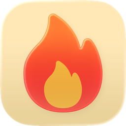
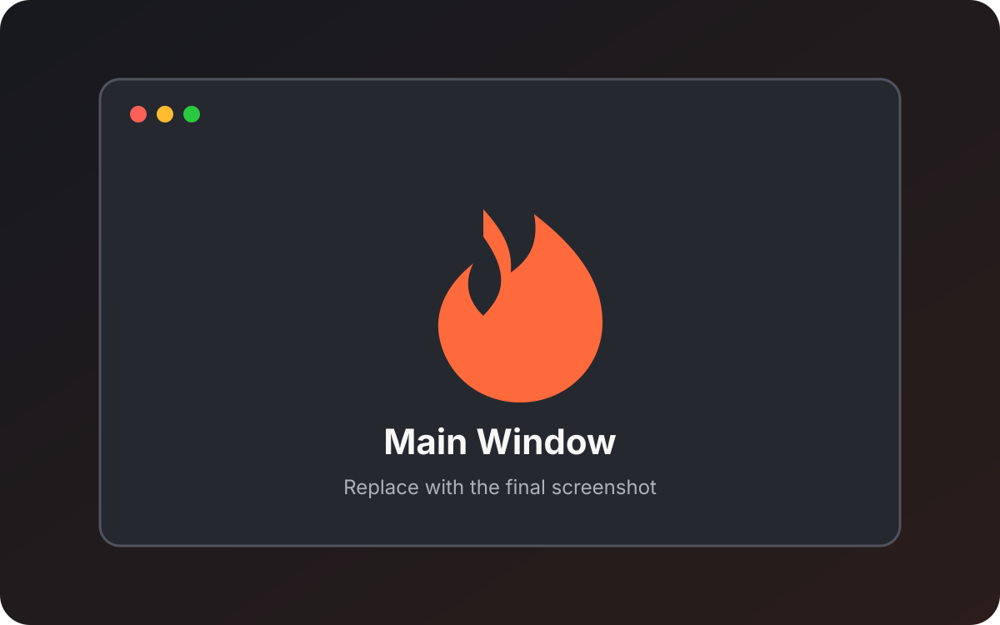
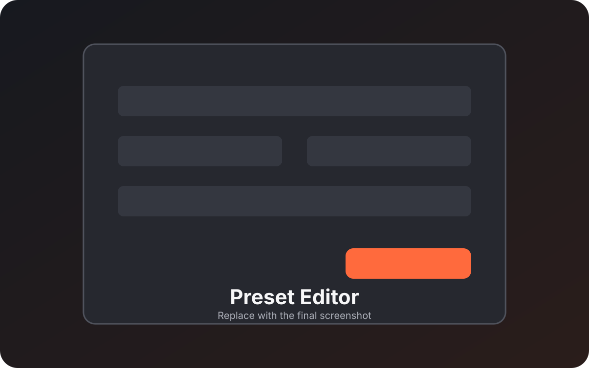
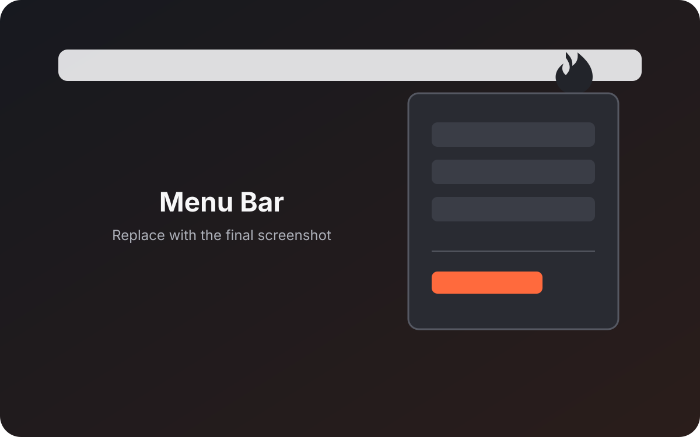
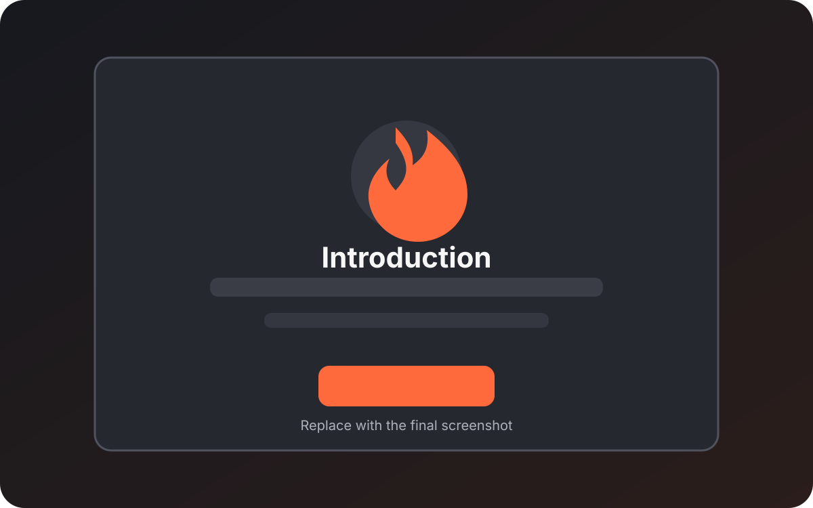

<h1 align="center">Arson</h1>

<p align="center">
  
</p>

<p align="center">
  A focused, native macOS utility for resizing and positioning windows with reusable presets and global shortcuts.
</p>

<p align="center">
  <a href="https://github.com/lukas-hzb/arson/actions/workflows/ci.yml"></a>
  <a href="https://github.com/lukas-hzb/arson/releases"></a>
  
  <a href="LICENSE"></a>
</p>

Arson keeps window management simple: focus a window, trigger a preset, and continue working. Presets can change width and height independently, align a window, apply offsets, and run from the menu bar or a global keyboard shortcut.

## Features

- **Reusable window presets** — Create, duplicate, reorder, enable, and edit named layouts.
- **Flexible sizing** — Keep a dimension unchanged or set it in points or as a percentage of the visible screen area.
- **Practical positioning** — Preserve the current position, center the window, or align it to the left or right edge.
- **Global shortcuts** — Apply presets without bringing Arson to the foreground.
- **Full-screen safety** — Shortcuts are suspended while the focused app is in full screen, allowing that app to handle the same keys without an Arson warning.
- **Native menu bar workflow** — The flame is the default menu bar symbol; alternative symbols and a fully hidden mode are available.
- **Background operation** — Closing the main window keeps presets and shortcuts available. Arson can also start at login.
- **Private by design** — Window data stays on the Mac. Arson has no analytics or telemetry; only the optional update check contacts GitHub.
- **Authenticated updates** — Sparkle verifies update archives and feeds with Arson's EdDSA key; this is separate from Apple Developer ID signing and notarization.

### Screenshots

The following placeholders can be replaced when final screenshots are available. Capture and replacement guidance is in [`docs/images/README.md`](docs/images/README.md).

| Main Window | Preset Editor |
| :---------: | :-----------: |
|  |  |

| Menu Bar | Introduction |
| :------: | :----------: |
|  |  |

## Installation

### Download a release

1. Open the [GitHub Releases](https://github.com/lukas-hzb/arson/releases) page.
2. Download the latest Arson DMG, open it, and drag `Arson.app` to `Applications`.
3. Open Arson and complete the introduction.
4. Grant access under **System Settings → Privacy & Security → Device Control & Data Access**. On older macOS versions, the setting is named **Accessibility**.

> [!IMPORTANT]
> The current preview is not signed with an Apple Developer ID or notarized. macOS may block its first launch until it is explicitly approved in Finder or **System Settings → Privacy & Security**.

### Build from source

Requirements:

- macOS 26 or later
- Xcode 26.5 or later
- Git

```bash
git clone https://github.com/lukas-hzb/arson.git
cd arson
./Scripts/install-local.sh
```

The installer builds the current checkout and maintains one canonical development copy at `/Applications/Arson.app`. See the [development guide](docs/DEVELOPMENT.md) for Xcode setup, installer options, permissions, architecture, and tests.

## Usage

1. Focus the window you want to change.
2. Choose a preset from Arson, the menu bar, or its assigned global shortcut.
3. Use the preset editor to combine independent width, height, position, and offset settings.
4. Use **Arson → Check for Updates…** or the matching menu bar item to check the configured release feed.

Fresh configurations include four starter presets:

| Preset | Shortcut | Behavior |
| :----- | :------- | :------- |
| Compact | `⌃⌘↩` | Resizes to 80% × 80% and centers the window. |
| Left Half | `⌃⌘←` | Uses the left half of the visible work area. |
| Right Half | `⌃⌘→` | Uses the right half of the visible work area. |
| Down and Right | `⌃⌘⌫` | Moves the current window 20 points right and down. |

Existing saved presets are never replaced by starter presets. Full-screen, non-resizable, and Arson-owned windows are left unchanged.

## Development

The repository separates product code, tests, release tooling, and longer-form documentation:

```text
Arson/
├── Arson/                 App, models, services, views, and resources
├── ArsonTests/            Unit tests
├── ArsonUITests/          UI and accessibility tests
├── Scripts/               Local installation and release utilities
├── docs/                  Development, release, and screenshot documentation
└── .github/               CI and contribution templates
```

- [Development and testing](docs/DEVELOPMENT.md)
- [Release and update process](docs/RELEASING.md)
- [Changelog](CHANGELOG.md)

## Tech Stack

| Layer | Technology |
| :---- | :--------- |
| **Language** | Swift 6 |
| **Interface** | SwiftUI and AppKit |
| **Window control** | macOS Accessibility APIs |
| **Global shortcuts** | Carbon hot keys |
| **Login item** | Service Management |
| **Updates** | Sparkle 2 |
| **Tests** | Swift Testing and XCTest |
| **Automation** | GitHub Actions |

## Credits

Arson is built with Apple's Swift, SwiftUI, AppKit, Accessibility, Carbon, and Service Management technologies.

- **[Sparkle](https://sparkle-project.org/)** provides the update framework under its own license.
- Third-party notices distributed with the app are stored in [`Arson/Resources/ThirdPartyLicenses`](Arson/Resources/ThirdPartyLicenses).

## Contributing

Bug reports and focused feature proposals are welcome. Code contributions and public forks require prior written authorization because Arson is proprietary source-available software. See [CONTRIBUTING.md](CONTRIBUTING.md) for known limitations, the contribution process, and contribution terms. Report vulnerabilities according to [SECURITY.md](SECURITY.md).

Development and test commands live in [docs/DEVELOPMENT.md](docs/DEVELOPMENT.md); release-only commands live in [docs/RELEASING.md](docs/RELEASING.md).

## License

This project is proprietary source-available software protected by copyright law. Private, personal, educational, and informational use is permitted under the conditions in [LICENSE](LICENSE); redistribution and commercial use require prior written permission.

Persona Non Grata: Daniel Harzbecker is expressly excluded from any license or permission to access or use Arson. Third-party components remain subject to their respective licenses.

Copyright (c) 2026 Lukas Harzbecker. All rights reserved.
